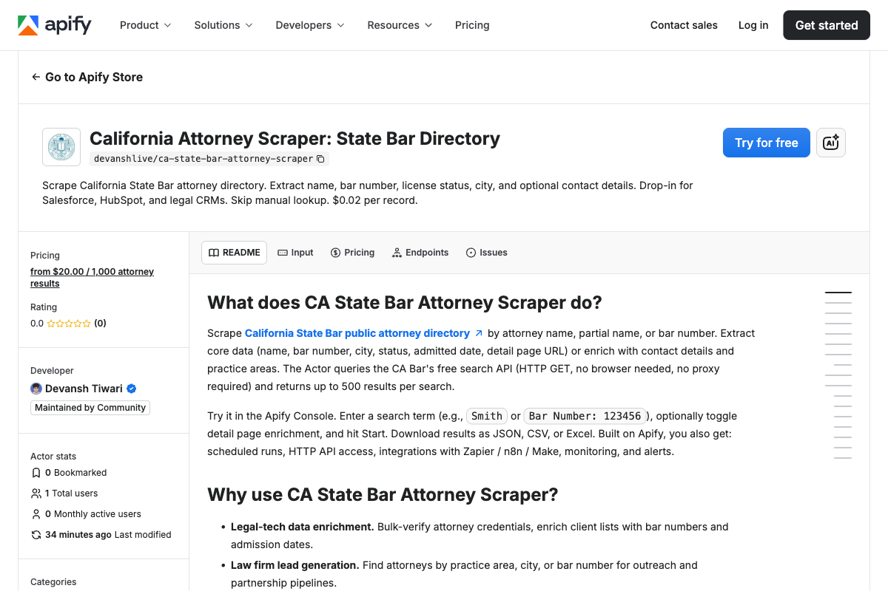

<div align="center">

# California Attorney Scraper: State Bar Directory as JSON

[](https://apify.com/devanshlive/ca-state-bar-attorney-scraper)
[](https://nodejs.org/)
[](https://github.com/getascraper)
[](https://github.com/getascraper/how-to-scrape-ca-attorneys)

**Extract attorney records from the California State Bar public directory into structured JSON with contact details in seconds.**

Built for legal tech teams, law firms, and compliance researchers who need bulk attorney data without manual directory lookups.

[Quick Start](#quick-start) · [API Reference](#api-reference) · [Pricing](#pricing) · [Support](#support)



</div>

---

## Quick Start

```javascript
import { ApifyClient } from 'apify-client';
import 'dotenv/config';

const client = new ApifyClient({ token: process.env.APIFY_TOKEN });

const run = await client.actor('devanshlive/ca-state-bar-attorney-scraper').call({
  searchValue: 'Smith',
  maxResults: 10,
  includeDetails: false,
});

const { items } = await client.dataset(run.defaultDatasetId).listItems();
console.log(items);
```

**Output:**
```json
{
  "name": "Smith, John A.",
  "barNumber": "123456",
  "city": "San Francisco",
  "status": "Active",
  "admittedDate": "2015-06",
  "detailUrl": "https://apps.calbar.ca.gov/attorney/LicenseeSearch/Detail/123456",
  "phone": "(415) 555-1234",
  "email": "john.smith@lawfirm.com",
  "address": "123 Market St, San Francisco, CA 94105",
  "practiceAreas": ["Business Law", "Real Estate"]
}
```

---

## Features

- **Name and bar number search** for targeted lookups
- **License status verification** including Active, Suspended, Disbarred
- **Optional contact details** including phone, email, and address
- **Practice area extraction** for specialization filtering
- **Admit date tracking** for seniority analysis

---

## What this actor does

This Actor extracts attorney records from the California State Bar public directory. It supports search by name or bar number, with optional contact details and practice areas.

It processes search results in batches, returning structured JSON with attorney metadata, license status, and contact information.

---

## Installation

```bash
npm install
```

Copy the environment file and add your Apify API token:

```bash
cp .env.example .env
```

Open `.env` and replace `your_apify_token_here` with your actual Apify API token. Get one free at [console.apify.com](https://console.apify.com/settings/integrations).

---

## Input

| Field | Type | Description | Default |
|-------|------|-------------|---------|
| `searchValue` | string | Name or bar number to search | none |
| `maxResults` | integer | Max results to return | 100 |
| `includeDetails` | boolean | Include contact details and practice areas | false |

---

## Output

Each attorney is a structured JSON record. Download as JSON, CSV, Excel, or HTML.

| Field | Description |
|-------|-------------|
| `name` | Attorney name as listed on CA Bar (Last, First, Middle) |
| `barNumber` | California bar license number (unique identifier) |
| `city` | City of record (mailing/office address) |
| `status` | License status: Active, Inactive, Suspended, Resigned, Deceased, Disbarred |
| `admittedDate` | Month and year admitted to California bar |
| `detailUrl` | Link to full detail page on CA Bar website |
| `phone` | Phone number (present only if `includeDetails: true`) |
| `email` | Email address (present only if `includeDetails: true`) |
| `address` | Full office/mailing address (present only if `includeDetails: true`) |
| `practiceAreas` | Array of practice areas (present only if `includeDetails: true`) |

See `sample-output.json` for a full example.

---

## Pricing

**$0.02 per record.**

A run of 100 records typically completes in 1 to 2 minutes. Pay only for what you extract.

---

## Use Cases

- **Legal-tech data enrichment:** Bulk-verify attorney credentials and enrich client lists
- **Law firm lead generation:** Find attorneys by practice area, city, or bar number
- **Compliance verification:** Check attorney status for due diligence and risk assessment
- **Journalist research:** Background checks and disciplinary history cross-reference
- **Competitive intelligence:** Track competitor attorneys and practice area presence

---

## FAQ

**What is a bar number?**
A California bar number is a unique identifier assigned to each licensed attorney. You can search by name or bar number.

**What details are included?**
Basic search returns name, bar number, city, status, and admit date. Set `includeDetails: true` for phone, email, address, and practice areas.

**Can I search by city?**
Yes. The search supports city names, but broader geographic searches may require multiple queries.

---

## Support

Open an issue in the [Apify Console](https://console.apify.com/actors/devanshlive~ca-state-bar-attorney-scraper/issues).

---

## Related Resources

- [California State Bar Attorney Search](https://apps.calbar.ca.gov/attorney/LicenseeSearch/QuickSearch)
- [Apify Client for JavaScript](https://docs.apify.com/api/client/js/)

---

**Ready to start extracting?**

[Open the California Attorney Scraper on Apify](https://apify.com/devanshlive/ca-state-bar-attorney-scraper)
